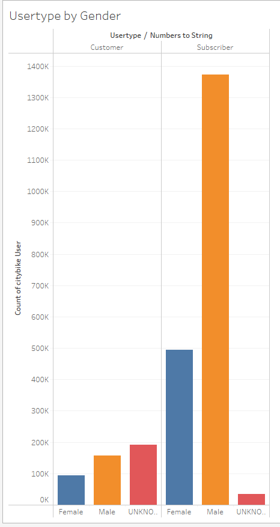
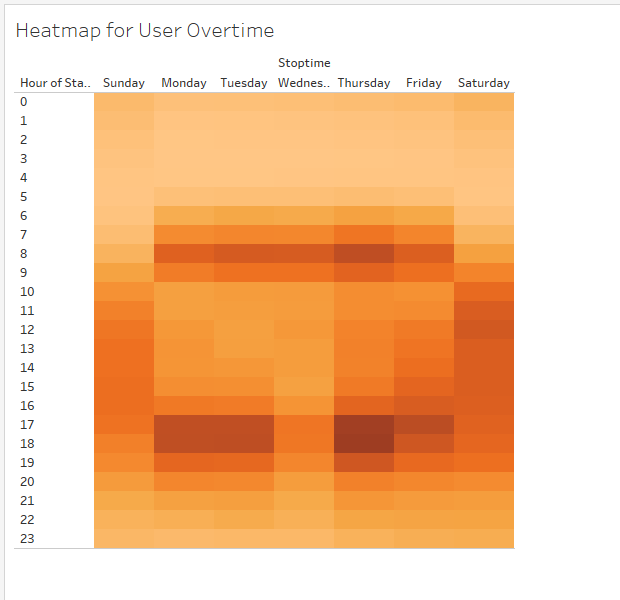
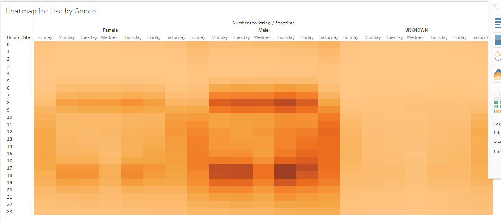
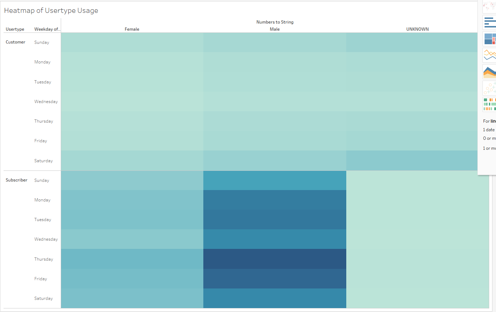
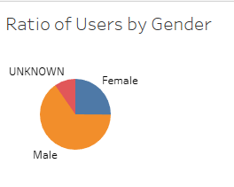
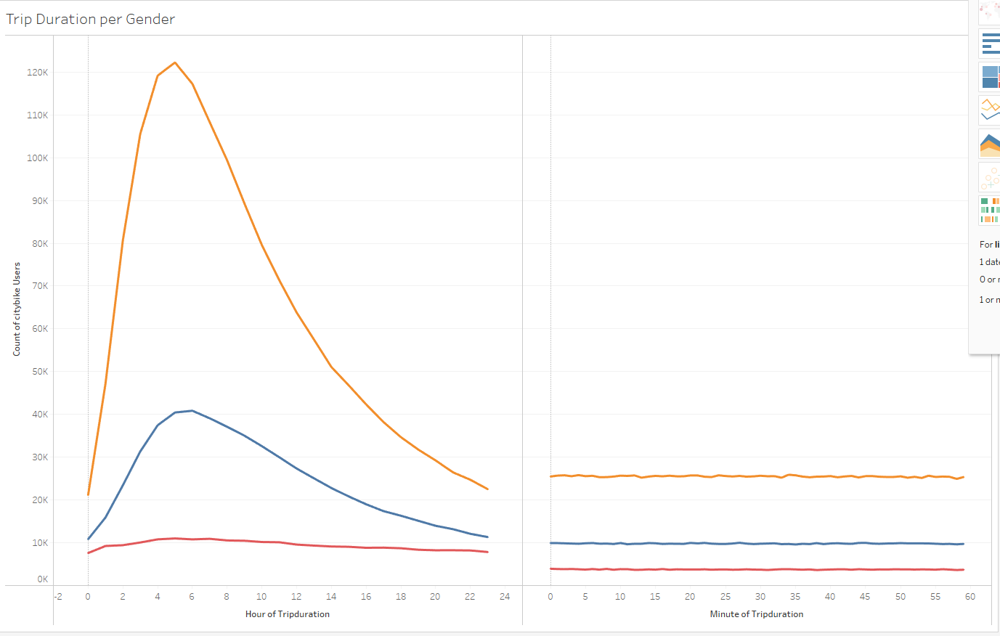
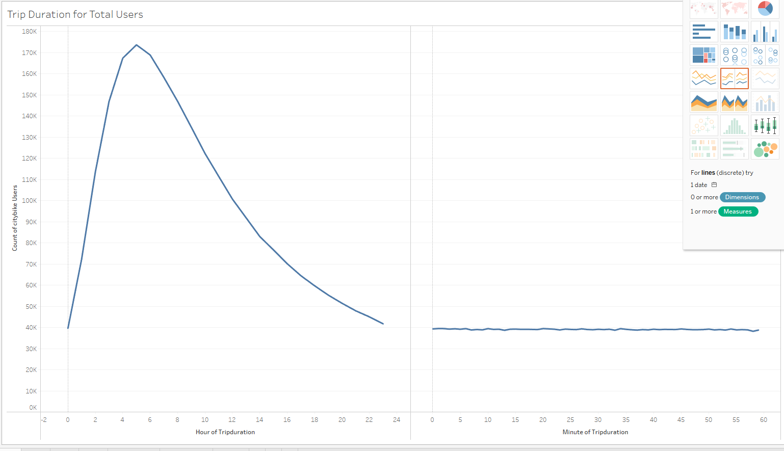
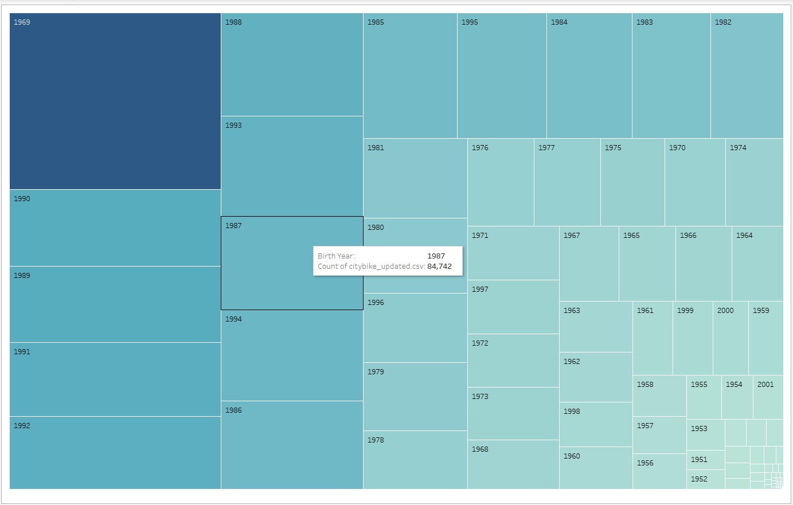
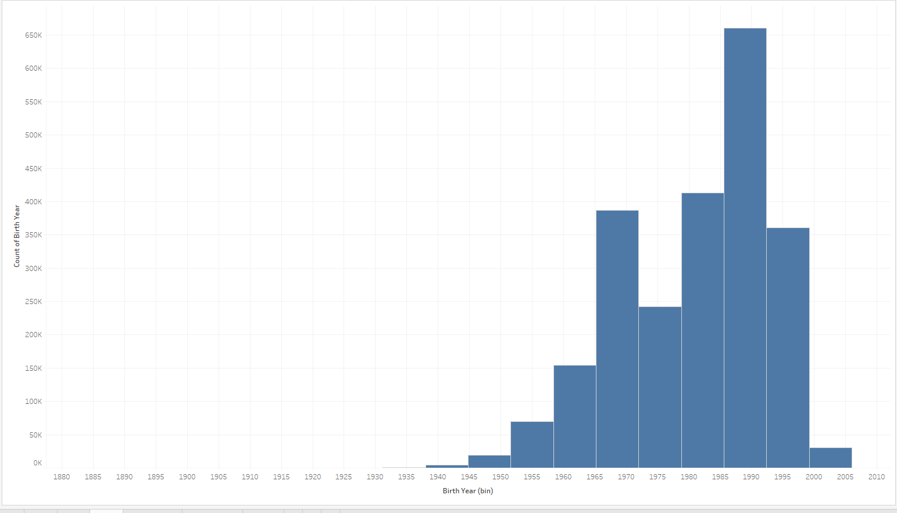

# Citibike-visualizations

## Purpose of this Anaylsis
The reason we analyized this dataset is to generate a statiscal picture of what kind of people are using citibike as well as to be able to present our findings to possible investors.

## Results
Gender breakdown of each Usertype

Heatmap of how many people are using the service at specific times of the week

heatmap of gender using the service at specific times of the weak

heatmap of customer type and gender usage a specific times during the week

pie chart showing the breakdown of the gender of the user base

trip duration for each gender

trip duration for userbase

## Conclusion
From our breakdown and anaylsis we find that the majority of the userbase are Subscribers and the average trip length is aroud 5 hours. Furthermore we uncovered that the majority of the traffic is between 17:00 and 19:00 hours. While our research shows how much the New York Citibike service is used, there are several issues when attemtping to bring the service over to Des Moines Iowa. First is the vast difference in population, with Des Moines only having 214,133 compared to New Yorks 8,804,190. Furthermore the cityscapes are vastly different. One of the main reason why biking in New York is so affective is because of how densely populated New York is and how bad the traffic is there. Furthermore New York has many sites and attractions close to each other. Des Moines doesn't have the same street level draw or traffic issues that would push people to use bikes. To add on Des Moines has the "Skywalks" that allows people to walk from building to building without having to go out onto the street. so in closing while yes it maybe viable around the city center more information is needed on the situation there is in Des Moines. Finally looking at age we see that the age make up of the users are people born the 1970s, and Des Moines average age is 33 which may again raise issues.

age of citibike users

the Standard deviation of the age of users

https://public.tableau.com/views/M14_D2_Finale_story/Story1?:language=en-US&publish=yes&:display_count=n&:origin=viz_share_link
